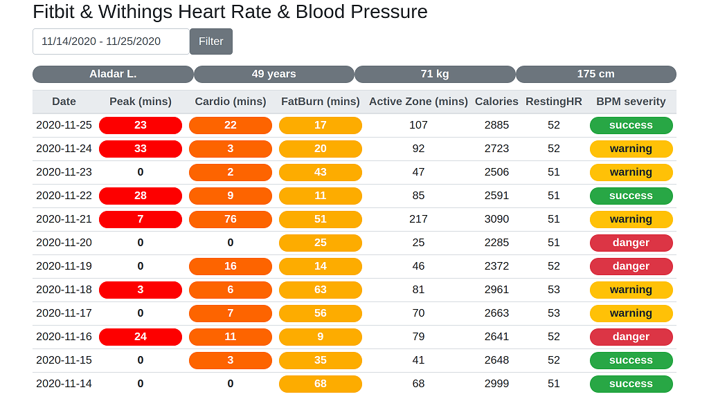

# Fitbit Heart Rate & Withings Blood Pressure
Experimental project to merge and visualize heart rate and blood pressure data
collected by different wearable devices.

If you have a [Fitbit](https://www.fitbit.com/) tracker or smartwatch you can access your personal
data by using the [Fitbit Web API](https://dev.fitbit.com/build/reference/web-api/).

For blood pressure monitoring I use a [Withings](https://www.withings.com/de/en/blood-pressure-monitors) device.
This tool stores your health data in the cloud that you can fetch by calling
the [Withings Health API](https://developer.withings.com/).

If you wear your tracker all day it measures automatically your heart rate.
Continuously measuring the blood pressure is harder, but you can do it manually.

The implementations of the data integration layers of this app can be found
in the [Withings React](https://github.com/fejesa/withings-react) and
[Fitbit React](https://github.com/fejesa/fitbit-react) repositories.

The dashboard shows the aggregated data grouping by day.


You can see the detailed view of the two data types by clicking a row.


## Installation and getting started
* Download and install [Node.js](https://nodejs.org/) 14+.
* Setup [Withings React](https://github.com/fejesa/withings-react) and [Fitbit React](https://github.com/fejesa/fitbit-react)
* Clone git repo: https://github.com/fejesa/fitbit-withings-ui
* Open the project folder in a terminal:
```
npm install              # fetches dependencies
npm start                # builds an application and starts the development server
```
* The application is available at http://localhost:4200 from your browser.

Note: The chart is rendered by the [LightningChart JS](https://www.arction.com/),
the data visualization library for JavaScript.
